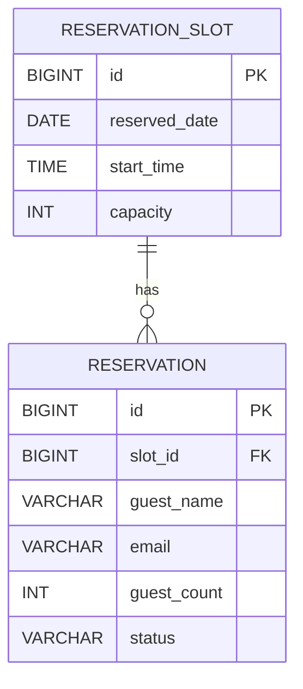

# DOCUMENT 08 DB設計書（予約システムMust）

## 1. 方針

DOCUMENT 07のMust要件（予約入力、空き状況確認、予約登録）を対象とする。既存の`model_course`等のテーブル・データは変更せず、予約機能に必要な新規テーブルのみを追加する。氏名・メールアドレス等の個人情報は管理者画面の認証済みセッションでのみ表示する。

## 2. テーブル定義

### reservation_slot（予約枠）

|カラム|型|キー|制約|
|---|---|---|---|
|id|BIGINT|PK|AUTO_INCREMENT|
|reserved_date|DATE||NOT NULL|
|start_time|TIME||NOT NULL|
|capacity|INT||NOT NULL, 1以上|
|created_at|TIMESTAMP||NOT NULL DEFAULT CURRENT_TIMESTAMP|
|updated_at|TIMESTAMP||NOT NULL DEFAULT CURRENT_TIMESTAMP ON UPDATE CURRENT_TIMESTAMP|

`reserved_date, start_time` はUNIQUE。定員は枠単位で管理する。

### reservation（予約）

|カラム|型|キー|制約|
|---|---|---|---|
|id|BIGINT|PK|AUTO_INCREMENT|
|slot_id|BIGINT|FK|reservation_slot(id), NOT NULL|
|guest_name|VARCHAR(100)||NOT NULL|
|email|VARCHAR(255)||NOT NULL|
|guest_count|INT||NOT NULL, 1以上|
|note|VARCHAR(1000)||NULL|
|status|VARCHAR(20)||NOT NULL DEFAULT 'CONFIRMED'|
|created_at|TIMESTAMP||NOT NULL DEFAULT CURRENT_TIMESTAMP|

同一枠・同一メールアドレス・有効状態の組合せをUNIQUEとし、二重登録を防止する。取消時は物理削除せず`CANCELLED`とする。

## 3. ER図・リレーション



予約枠1件に対して予約は0件以上。残席は `capacity - SUM(guest_count)` で算出する。

## 4. CREATE TABLE

```sql
CREATE TABLE IF NOT EXISTS reservation_slot (
  id BIGINT NOT NULL AUTO_INCREMENT,
  reserved_date DATE NOT NULL,
  start_time TIME NOT NULL,
  capacity INT NOT NULL,
  created_at TIMESTAMP NOT NULL DEFAULT CURRENT_TIMESTAMP,
  updated_at TIMESTAMP NOT NULL DEFAULT CURRENT_TIMESTAMP ON UPDATE CURRENT_TIMESTAMP,
  PRIMARY KEY (id), UNIQUE KEY uq_reservation_slot_time (reserved_date, start_time),
  CONSTRAINT chk_reservation_slot_capacity CHECK (capacity > 0)
) ENGINE=InnoDB;

CREATE TABLE IF NOT EXISTS reservation (
  id BIGINT NOT NULL AUTO_INCREMENT,
  slot_id BIGINT NOT NULL,
  guest_name VARCHAR(100) NOT NULL,
  email VARCHAR(255) NOT NULL,
  guest_count INT NOT NULL,
  note VARCHAR(1000), status VARCHAR(20) NOT NULL DEFAULT 'CONFIRMED',
  created_at TIMESTAMP NOT NULL DEFAULT CURRENT_TIMESTAMP,
  PRIMARY KEY (id),
  UNIQUE KEY uq_reservation_active (slot_id, email, status),
  KEY idx_reservation_slot_status (slot_id, status),
  CONSTRAINT fk_reservation_slot FOREIGN KEY (slot_id) REFERENCES reservation_slot(id),
  CONSTRAINT chk_reservation_guest_count CHECK (guest_count > 0),
  CONSTRAINT chk_reservation_status CHECK (status IN ('CONFIRMED','CANCELLED'))
) ENGINE=InnoDB;
```

## 5. 初期データ

```sql
INSERT INTO reservation_slot (reserved_date, start_time, capacity) VALUES
('2026-10-10','11:00:00',5), ('2026-10-10','13:00:00',5), ('2026-10-10','15:00:00',5);
```

## 6. MyBatis Mapper設計

`ReservationSlotMapper`：枠一覧、枠ID取得、残席数取得、予約枠の行ロック取得。

`ReservationMapper`：有効予約の人数集計、メール重複確認、予約登録、管理者向け個人情報一覧。

登録処理はServiceの`@Transactional`内で枠を`SELECT ... FOR UPDATE`し、重複確認と定員確認後にINSERTする。これにより同時リクエストでも定員超過を防止する。
